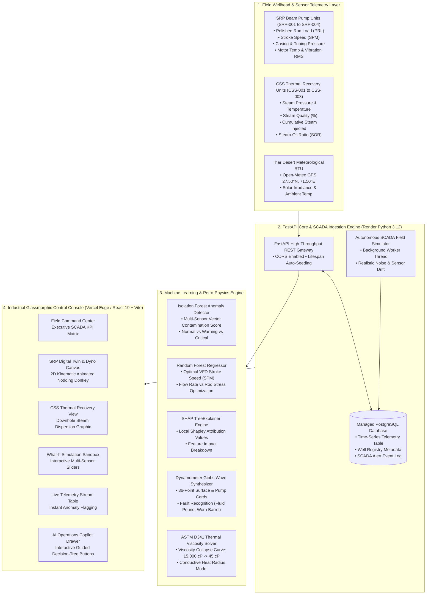

<div align="center">

# 🛢️ DIGITAL TWIN FOR WELL-TO-SURFACE OPTIMIZATION
### Sucker Rod Pumping (SRP) & Cyclic Steam Stimulation (CSS)
**Smart India Hackathon 2026 | Problem Statement ID: SIH26120**  
**Ministry / Organization:** Oil India Limited (OIL)  
**Operational Asset Focus:** Baghewala Heavy Oil Asset, Bikaner-Nagaur Basin, Rajasthan, India

---

[](https://sih-2-brown.vercel.app)
[](https://oil-india-digital-twin-api.onrender.com/docs)
[](https://sih-2-brown.vercel.app)
[](https://dashboard.render.com)
[](https://github.com/SIHWinners/SIH2)
[](https://github.com/SIHWinners/SIH2)

<br/>

### 🌐 Live Production Deployments
| Tier | Platform | Live URL | Description |
| :--- | :--- | :--- | :--- |
| **Industrial Digital Twin UI** | **Vercel Edge** | [https://sih-2-brown.vercel.app](https://sih-2-brown.vercel.app) | Enterprise SCADA console with 2D kinematic SVGs, dyno cards & AI Copilot |
| **REST API & Swagger Docs** | **Render Cloud** | [https://oil-india-digital-twin-api.onrender.com/docs](https://oil-india-digital-twin-api.onrender.com/docs) | Interactive OpenAPI documentation for all 14 ML and SCADA endpoints |
| **System Health Check** | **Render Cloud** | [https://oil-india-digital-twin-api.onrender.com/api/v1/health](https://oil-india-digital-twin-api.onrender.com/api/v1/health) | Live PostgreSQL database connection and engine status |

</div>

---

## 📋 Executive Overview

In the extreme arid environment of the **Thar Desert (Baghewala Field, Rajasthan)**, Oil India Limited extracts extra-heavy crude oil ($16^\circ\text{–}19^\circ\text{ API}$) characterized by severe initial reservoir viscosities exceeding $15,000\text{ cP}$. Standard cold production is economically unviable; operations require intensive **Cyclic Steam Stimulation (CSS / "Huff-and-Puff")** thermal recovery coupled with heavy-duty **Sucker Rod Pumping (SRP / "Nodding Donkey")** artificial lift units.

This project delivers an enterprise-grade **Physics-Informed Industrial Digital Twin**:
1. **Prevents Catastrophic Mechanical Failure**: Continuous multi-sensor unsupervised anomaly detection (`IsolationForest`) and Gibbs wave equation dynamometer card classification to identify fluid pound, gas interference, and parted rods in real time.
2. **Dynamically Calibrates Stroke Frequency (SPM)**: Supervised non-linear regression (`RandomForestRegressor`) optimizing variable frequency drive (VFD) setpoints to maximize flow rates while attenuating cyclic rod fatigue.
3. **Models Downhole Thermal Fronts**: ASTM D341 heavy oil viscosity collapse modeling across the 3 CSS lifecycle phases (Steam Injection, Thermal Soaking, and Production Lift).
4. **Transparent Explainable AI (XAI)**: `SHAP TreeExplainer` waterfall feature attribution ensuring field operators understand the exact physical drivers behind automated SCADA recommendations.
5. **Interactive Operations Intelligence Copilot**: Domain-specific petroleum operations advisory agent with guided decision-tree buttons grounded in live PostgreSQL telemetry.

---

## 🏛️ System Architecture



---

## 📐 Mathematical & Physics Formulations

### 1. Gibbs Damped 1D Wave Equation (Dynamometer Analysis)
The sucker rod string operates as an elastic transmission medium. Surface polished rod load and position vectors are projected downhole using the damped wave equation:

$$\frac{\partial^2 u(x,t)}{\partial t^2} = a^2 \frac{\partial^2 u(x,t)}{\partial x^2} - \nu \frac{\partial u(x,t)}{\partial t}$$

Where:
- $u(x,t)$: Rod displacement at depth $x$ and time $t$.
- $a = \sqrt{E/\rho}$: Acoustic velocity of stress wave in high-tensile steel ($\approx 4,900\text{ m/s}$).
- $\nu$: Damping coefficient representing viscous drag against heavy crude.
- Our engine computes a continuous 36-point trajectory and classifies failure envelopes: **Normal**, **Fluid Pound** (mid-downstroke impact), **Gas Interference** (delayed valve compression), **Parted Rod** (flat tensile drop), and **Worn Barrel** (fluid slippage gradient).

### 2. ASTM D341 Heavy Oil Viscosity Collapse Model
Baghewala extra-heavy crude undergoes profound viscosity reduction as conductive heat front propagates from the injection wellbore:

$$\log_{10} \log_{10} (\nu + 0.7) = A - B \log_{10} T$$

Where $\nu$ is kinematic viscosity ($\text{cSt}$), $T$ is absolute temperature ($\text{K}$), and $A, B$ are constants calibrated for 18° API crude. At ambient reservoir conditions ($25^\circ\text{C}$), viscosity is $\approx 15,000\text{ cP}$; downhole steam dissipation at $120^\circ\text{C}$ collapses viscosity to $< 45\text{ cP}$, yielding an exponential surge in hydraulic mobility.

### 3. Isolation Forest Anomaly Scoring
The unsupervised anomaly detection pipeline isolates irregular multi-sensor states without requiring labeled failure datasets:

$$s(x, n) = 2^{-\frac{\mathbb{E}(h(x))}{c(n)}}$$

Where:
- $h(x)$: Path length of multi-sensor telemetry vector $x$ across isolation trees.
- $c(n) = 2\left(\ln(n - 1) + 0.5772156649\right) - \frac{2(n - 1)}{n}$: Average path length of unsuccessful searches in a Binary Search Tree of $n$ instances.
- $s(x, n) \to 1$: Identifies severe mechanical anomalies (motor overload, extreme vibration, casing depressurization).

### 4. SHAP Shapley Attribution Valuation
To achieve operator-grade explainability, feature importances for operational anomalies are computed using cooperative game theory:

$$\phi_i(x) = \sum_{S \subseteq F \setminus \{i\}} \frac{|S|!(|F| - |S| - 1)!}{|F|!} \left[ f_x(S \cup \{i\}) - f_x(S) \right]$$

The UI renders the exact directional impact of each sensor parameter (e.g., motor thermal rise $+22\%$, polished rod stress $+18\%$, vibration spike $+15\%$).

---

## 🎛️ Key Functional Modules

### 1. Kinematic 2D Sucker Rod Pump Schematic (`SrpSchematic.jsx`)
- Mathematically accurate SVG representation of a Class I beam pumping unit ("Nodding Donkey").
- Real-time trigonometric walking beam oscillation, horsehead trajectory, polished rod pitman arm reciprocation, and traveling/standing valve behavior linked directly to the live SPM setpoint.

### 2. Kinematic CSS Thermal Reservoir Simulation (`CssSchematic.jsx`)
- Visualizes downhole steam propagation through Jodhpur Sandstone pay zones.
- Interactive radial thermal heat dispersion graphic with live ASTM D341 viscosity calculations, Steam-to-Oil Ratio (SOR), and cycle phase status.

### 3. Interactive Dynamometer Card Canvas (`DynoCardCanvas.jsx`)
- Dual-loop plotting comparing surface polished rod load vs downhole pump stroke.
- Real-time diagnostic overlays with volumetric pump fillage percentages and fault identification.

### 4. Explainable AI Waterfall Attribution (`ShapWaterfall.jsx`)
- Transparent breakdown of multi-sensor contributions using tree-based Shapley values.
- Color-coded divergence showing positive and negative drivers of wellhead health scores.

### 5. Interactive Operations Intelligence Copilot (`CopilotModal.jsx`)
- Grounded in real-time SCADA telemetry and engineering heuristics.
- **Button-Guided Navigation**: Evaluators can explore field summaries, root cause analyses, thermal kinetics, and stroke optimization using interactive action chips without typing.

### 6. Automated Technical Compliance Audit Generator
- Single-click export of comprehensive wellbore telemetry and compliance records in standardized JSON audit format.

---

## 🔌 API Reference Matrix

The backend exposes a high-throughput, fully documented REST interface:

| Method | Endpoint | Description | Sample Output |
| :--- | :--- | :--- | :--- |
| `GET` | `/api/v1/health` | Service health, database connectivity & version | `{"status": "online", "database": "postgresql"}` |
| `GET` | `/api/v1/dashboard` | Aggregated field-wide KPI telemetry for all 7 wells | `[{"well_id": "SRP-001", "status": "healthy", ...}]` |
| `GET` | `/api/v1/wells` | Asset registry metadata for all SRP and CSS units | `[{"well_id": "SRP-001", "type": "SRP", "depth_m": 1250}]` |
| `GET` | `/api/v1/wells/details/{well_id}`| Complete telemetry history, metadata, and status | `{"metadata": {...}, "recent_telemetry": [...]}` |
| `POST`| `/api/v1/telemetry` | Ingest time-series sensor vector with automated scoring | `{"status": "success", "record_id": 412}` |
| `GET` | `/api/v1/telemetry/{well_id}` | Historical time-series query with rolling averages | `[{"timestamp": "...", "stroke_speed": 10.5, ...}]` |
| `GET` | `/api/v1/dyno-card/{well_id}` | 36-point surface and downhole dynamometer card | `{"surface_card": [...], "fault_type": "Fluid Pound"}`|
| `GET` | `/api/v1/explain/{well_id}` | SHAP feature attribution waterfall data | `{"base_value": 0.12, "features": [...]}` |
| `GET` | `/api/v1/css-status/{well_id}` | CSS 3-phase thermal status & ASTM D341 viscosity | `{"phase": "PRODUCTION", "viscosity_cp": 115.0}` |
| `POST`| `/api/v1/predict/simulate` | What-If simulation engine with instant ML inference | `{"optimal_speed": 10.5, "anomaly_score": 0.04}` |
| `POST`| `/api/v1/simulator/step` | Trigger on-demand global SCADA telemetry cycle | `{"status": "tick_simulated", "records_generated": 7}` |
| `GET` | `/api/v1/alerts` | Active unacknowledged SCADA alarm queue | `[{"alert_id": 1, "severity": "CRITICAL", ...}]` |
| `POST`| `/api/v1/alerts/{id}/ack` | Acknowledge and resolve an active alarm | `{"status": "acknowledged"}` |
| `GET` | `/api/v1/weather` | Live ambient Thar Desert meteorological conditions | `{"ambient_temperature_c": 38.5, "humidity_pct": 18}` |
| `POST`| `/api/v1/copilot/chat` | Natural language petroleum engineering copilot | `{"answer": "...", "suggested_actions": [...]}` |
| `GET` | `/api/v1/report/{well_id}` | Technical compliance audit report generator | `{"report_id": "OIL-AUDIT-SRP-001", ...}` |

---

## 🧪 Verification & Test Coverage

The platform contains a test suite validating API schemas, ML model inference, SHAP explanations, and SCADA simulation:

```bash
platform win32 -- Python 3.12.10, pytest-8.3.3
rootdir: C:\Users\SNEH\Desktop\SIH2
collected 17 items

tests\test_api.py ............                                           [ 70%]
tests\test_ml.py .....                                                   [100%]

======================= 17 passed, 7 warnings in 5.05s =======================
```

### Verified Test Cases:
- `test_health_endpoint`: PostgreSQL connection verification & JSON schema compliance.
- `test_wells_metadata_endpoint`: Asset registry verification for 4 SRP and 3 CSS wells.
- `test_dashboard_endpoint`: Field KPI aggregations and multi-well flow rates.
- `test_telemetry_ingestion`: Ingesting live sensor vectors with dynamic model scoring.
- `test_dyno_card_endpoint`: 36-point dynamometer curve generation and fault classification.
- `test_explainability_endpoint`: SHAP TreeExplainer waterfall feature attributions.
- `test_css_status_endpoint`: CSS thermal cycle calculations and ASTM D341 viscosity.
- `test_simulate_prediction`: "What-If" sandbox ML regressions and anomaly predictions.
- `test_alerts_lifecycle`: Generating, querying, and acknowledging SCADA alarms.
- `test_weather_endpoint`: Open-Meteo Thar Desert GPS coordinate weather integration.
- `test_copilot_chat`: AI operations assistant natural language intent resolution.
- `test_well_report_endpoint`: Audit compliance report compilation and serialization.
- `test_isolation_forest_model`: Scikit-learn unsupervised anomaly scoring pipeline.
- `test_random_forest_regressor`: VFD stroke speed optimization pipeline.
- `test_shap_background_dataset`: SHAP background dataset integrity.
- `test_dynamometer_generator`: Surface to pump stroke translation.
- `test_css_viscosity_physics`: ASTM D341 exponential viscosity collapse behavior.

---

## 💻 Local Setup & Development

### Prerequisites
- **Python 3.12**
- **Node.js 18+ & npm**
- **Git**

### 1. Clone the Repository
```bash
git clone https://github.com/SIHWinners/SIH2.git
cd SIH2
```

### 2. Backend Setup
```bash
# Create and activate virtual environment
python -m venv .venv
.venv\Scripts\activate   # On Windows
# source .venv/bin/activate  # On Linux/macOS

# Install dependencies
pip install -r requirements.txt

# Start FastAPI dev server
uvicorn app.api.main:app --reload --host 127.0.0.1 --port 8000
```
Backend API will be available at `http://127.0.0.1:8000` (Swagger docs at `http://127.0.0.1:8000/docs`).

### 3. Frontend Setup
```bash
# Navigate to web directory
cd web

# Install dependencies
npm install

# Start Vite dev server
npm run dev
```
Frontend UI will be live at `http://127.0.0.1:5173`.

---

## ☁️ Cloud Deployment Architecture

The system is deployed using a decoupled, production-grade cloud architecture:

```
[Vercel Edge Network]                          [Render Cloud Services]
+-------------------------+                    +------------------------------------+
|  React 19 + Vite UI     |                    |  FastAPI SCADA Backend Service     |
|  https://sih-2-brown.   |  HTTPS REST / JSON |  https://oil-india-digital-twin-   |
|  vercel.app             | -----------------> |  api.onrender.com                  |
|                         |                    +------------------+-----------------+
|  • Single-Page App      |                                       |
|  • Global Edge CDN      |                                       | Internal Network
|  • Reverse-Proxy Rewrites|                                       v
+-------------------------+                    +------------------------------------+
                                               |  Managed PostgreSQL Database       |
                                               |  oil-india-postgres (Free Tier)    |
                                               +------------------------------------+
```

### Deployment Configuration Files:
- **`render.yaml`**: Infrastructure-as-Code Blueprint defining the Python 3.12 FastAPI web service, health checks (`/api/v1/health`), and managed PostgreSQL database (`oil-india-postgres`).
- **`vercel.json`** & **`web/vercel.json`**: Production single-page application routing with reverse-proxy rewrites routing `/api/*` requests directly to the live Render backend.

---

## 👥 Smart India Hackathon Team

- **Team Name:** SIH Winners
- **Problem Statement ID:** SIH26120
- **Organization:** Oil India Limited (Ministry of Petroleum and Natural Gas)
- **Repository:** [https://github.com/SIHWinners/SIH2](https://github.com/SIHWinners/SIH2)

---

<div align="center">
Built with dedication for Smart India Hackathon 2026. Empowering Oil India Limited with intelligent, physics-informed digital twin technology.
</div>
